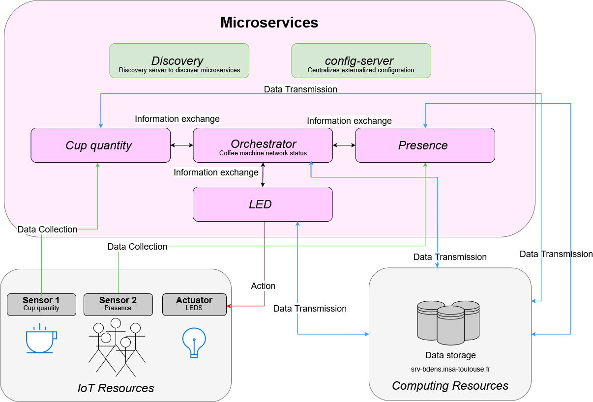

# Automation of the INSA's coffee management

We want to develop a Web application (Proof-of-Concept) for managing  INSA's coffee machines. Through software services (microservices), the application retrieves data of sensors (temperature, presence, ...), and according to the values of the retrieved data, actions on actuators can be triggered. This application must allow:

| Sensors | Actuators | Specificities | (Add'on) |
| ------- | --------- | ------------- | --------- |
| Cup quantity | A LED in front of each departments | green : ok, blue: degraded service (no more cup), red: out of order | (Infos can also be communicated throw campus application or screens presents in the hall of the departments) |
| Presence | // |  orange : too much people | // |

## Asked work

- [ ] Design an application based on microservices
- [ ] Implement the different services and services calls
- [ ] Implement a web interface for viewing the history of actions
- [ ] Language to use : Java.
- [ ] Framework to use : SpringBoot

## Microservice architecture



We don't make the whole system so we don't manage the coffee machine itself, there's no real point in adding a microservice for that.

1. Recording of cup quantities. --> ML

    ``` bash
    curl -X POST "http://localhost:8081/api/cup-Ms?machineId=1&value=10" #pour ajouter uen valeur de nombre de cup à la machine d'id 1 (GEI)
    ```

2. Presence analysis. --> ML

    ``` bash
    curl -X POST "http://localhost:8082/api/presence-Ms?machineId=1&value=3" # Enregistrer une valeur
    curl http://localhost:8082/api/presence-Ms/history/1 # Récupérer l'historique
    ```

3. LEDs management. --> ...
4. Machine network status (Orchestrator): analysis of cup presence and level and sending to LEDs --> Amalia
    - BDD: name, building, condition, date last visit ---> ML
5. (*Other notifications (software): deposit of a ticket to the admin, campus applications, screens at the entrance of the departments*)

## Database architecture

- A table `machine`: storage of the static infos of the coffee machines:
  - machine_id
  - building
  - condition :'operational', 'degraded', 'out_of_order'
  - last_visit

``` SQL
-- Table `machine`
CREATE TABLE IF NOT EXISTS machine (
    machine_id BIGINT PRIMARY KEY AUTO_INCREMENT,
    building VARCHAR(50) NOT NULL,
    status ENUM('operational', 'degraded', 'out_of_order') NOT NULL,
    last_visit DATETIME
);
```

- A table `cup_sensor`: data storage for the cup sensor:
  - sensor_id
  - machine_id (foreign key)
  - value
  - timestamp

``` SQL

-- Table `cup_sensor`
CREATE TABLE IF NOT EXISTS cup_sensor (
    sensor_id BIGINT PRIMARY KEY AUTO_INCREMENT,
    machine_id BIGINT NOT NULL,
    value INT NOT NULL,
    timestamp DATETIME NOT NULL,
    FOREIGN KEY (machine_id) REFERENCES machine(machine_id)
);

```

- A table `presence_sensor`: data storage for the presence sensor:
  - sensor_id
  - machine_id (foreign key)
  - value
  - timestamp

``` SQL
  CREATE TABLE IF NOT EXISTS presence_sensor (
    sensor_id BIGINT PRIMARY KEY AUTO_INCREMENT,
    machine_id BIGINT NOT NULL,
    value INT NOT NULL,  -- Nombre de personnes détectées
    timestamp DATETIME NOT NULL,
    FOREIGN KEY (machine_id) REFERENCES machine(machine_id)
);
```

- A table `actions_history`: storage of the actions that have been made before:
  - action_id
  - machine_id (foreign key)
  - status :'green', 'blue', 'red', 'orange', 'off',
  - timestamp
- *(A table `notifications`: storage of the notifications that have been sent (admin, screens))*

## Reporting

- To return on 21/01
- Add:
  - [ ] Architecture diagram (microservices)
  - [ ] Class Diagram
  - [ ] Use case diagram
